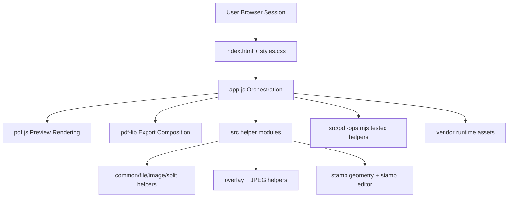

# Architecture Diagram

```mermaid
flowchart TD
    User["User Browser Session"] --> UI["index.html + styles.css"]
    UI --> Runtime["app.js Orchestration"]
    Runtime --> Preview["pdf.js Preview Rendering"]
    Runtime --> Export["pdf-lib Export Composition"]
    Runtime --> Helpers["src helper modules"]
    Helpers --> Common["common/file/image/split helpers"]
    Helpers --> Overlay["overlay + JPEG helpers"]
    Helpers --> Stamp["stamp geometry + stamp editor"]
    Runtime --> Tested["src/pdf-ops.mjs tested helpers"]
    Runtime --> Vendor["vendor runtime assets"]
```
