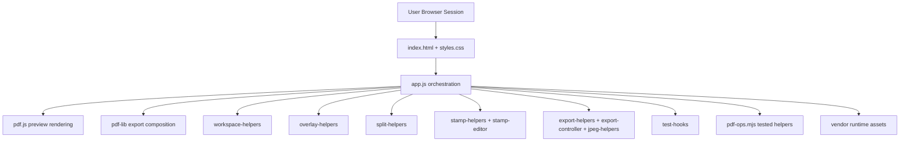

# Architecture Diagram

```mermaid
flowchart TD
    User["User Browser Session"] --> UI["index.html + styles.css"]
    UI --> Runtime["app.js orchestration"]
    Runtime --> Preview["pdf.js preview rendering"]
    Runtime --> ExportCore["pdf-lib export composition"]
    Runtime --> Workspace["workspace-helpers"]
    Runtime --> Overlay["overlay-helpers"]
    Runtime --> Split["split-helpers"]
    Runtime --> Stamp["stamp-helpers + stamp-editor"]
    Runtime --> ExportFlow["export-helpers + export-controller + jpeg-helpers"]
    Runtime --> TestHooks["test-hooks"]
    Runtime --> Tested["pdf-ops.mjs tested helpers"]
    Runtime --> Vendor["vendor runtime assets"]
```
